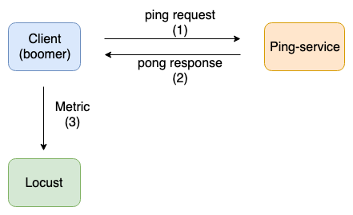
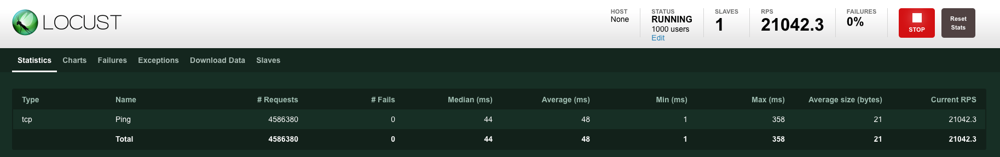
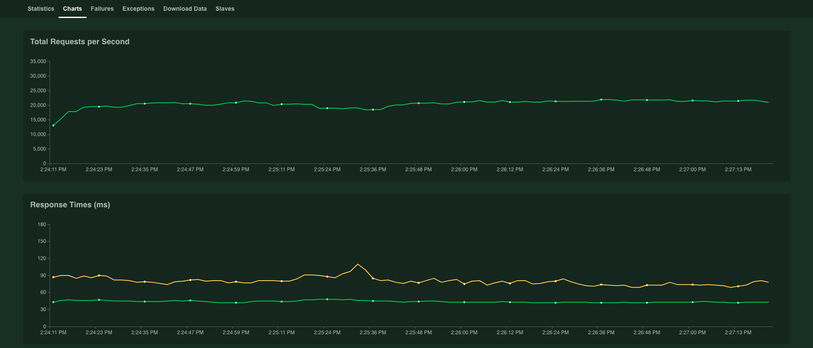
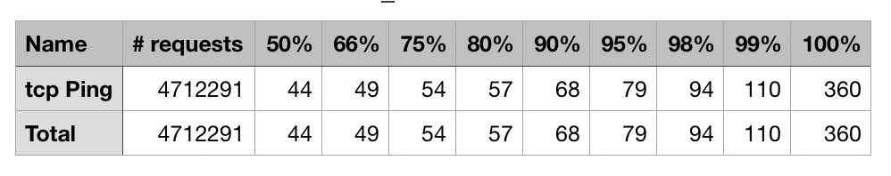

# Ping service gRPC

## Overview
Using the [gRPC](https://github.com/grpc/grpc-go) framework to build a simple **ping-service** that supports ping pong API. Then using the [locust](https://locust.io/) and [boomer](https://github.com/myzhan/boomer) to benchmark ping-service. In addition the ping-service is implemented in [golang](https://golang.org/) language.

## Architecture
<div align="center">
  
</div>

## Requirment
- Golang.
- Locust.

## Installation
- Install [Golang](https://golang.org/doc/install).
- Install [Locust](https://docs.locust.io/en/latest/installation.html)

## Build

```sh
#clone project
$ git clone 
```

## Run
- Run locust

```sh
# go to directory locust 
$ cd ./locust
$ chmod +x run_locust.sh

# run locust
./run_locust.sh
```

- Run service
  
```sh
# go to directory ./cmd/server
$ cd ./cmd/server

# build service
$ go build server

# run service
$ ./server
INFO[0000] Start Ping service port 10002 ... 
```
- Run benchmark

```sh
# go to directory ./benchmark/run
$ cd ./benchmark/run

# build
$ go build

# run benchmark
$ ./run
2019/07/26 14:55:32 Boomer is built with gomq support.
2019/07/26 14:55:46 Boomer is connected to master(tcp://127.0.0.1:5557) press Ctrl+c to quit.
```

## Infomation benchmark
### Hardware configuration
- MacBook Pro v10.14.5
- CPU: **2.3 GHz Intel Core i5**
- RAM: **16 GB 2133 MHz LPDDR3**

### Scenario
- Use `1000 users` to call ping API at the same time.
  
### Result

- **Dashboard**
  
<div align="center">
  
</div>

- **Overview chart**
  
<div align="center">
  
</div>

- **p99**
  
<div align="center">
  
</div>

- **Monitor the Processes**

<div align="center">
  
</div>

### Evaluation
- Ping servic average loaded 20000 req/s.
- Average processing of 1 request takes 48ms.
- p99 is 110ms.
- CPU is used at full capacity.

## Contribution
If you find anything wrong or would like to contribute in any way, feel free to create a pull request/open an issue/send me a message. Any comments are welcome!

## Acknowledgments
- Thanks [locust](https://locust.io/) and [boomer](https://github.com/myzhan/boomer) for the open source is great.